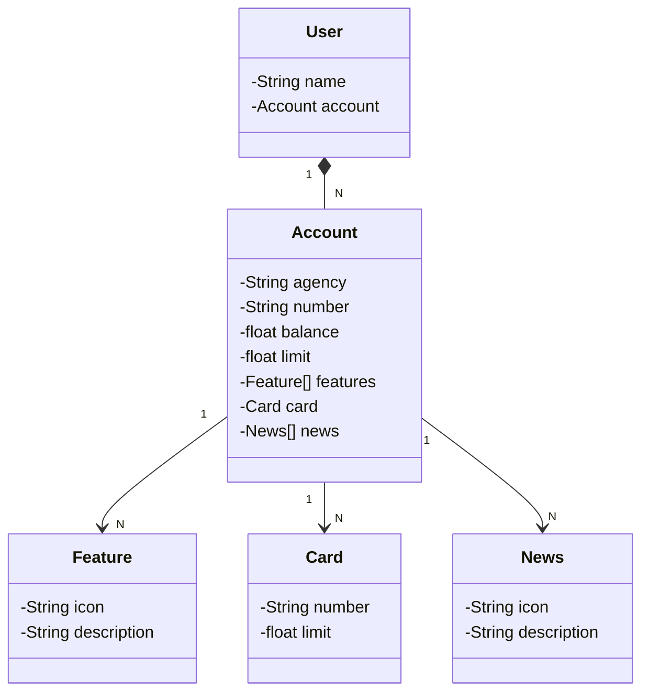

# API RESTful com Java Spring Boot

## Diagrama de Classes

```mermaid
classDiagram
    class User {
        -String name
        -Account account
    }

    class Account {
        -String agency
        -String number
        -float balance
        -float limit
        -Feature[] features
        -Card card
        -News[] news
    }

    class Feature {
        -String icon
        -String description
    }

    class Card {
        -String number
        -float limit
    }

    class News {
        -String icon
        -String description
    }

    User "1" *-- "N" Account
    Account "1" --> "N" Feature
    Account "1" --> "N" Card
    Account "1" --> "N" News
```
